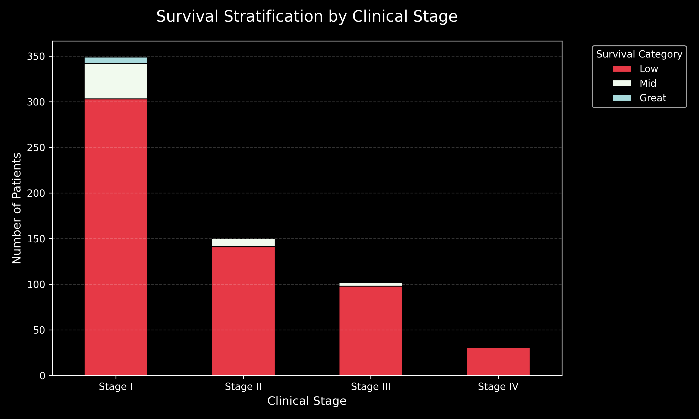
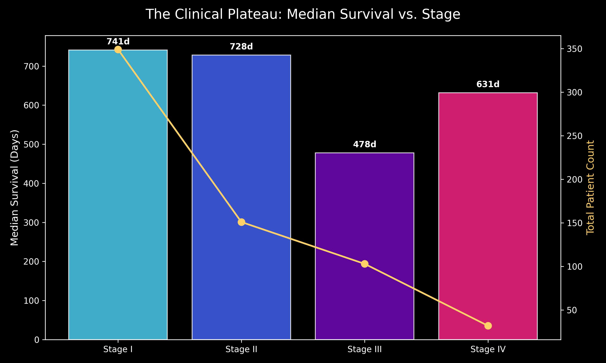
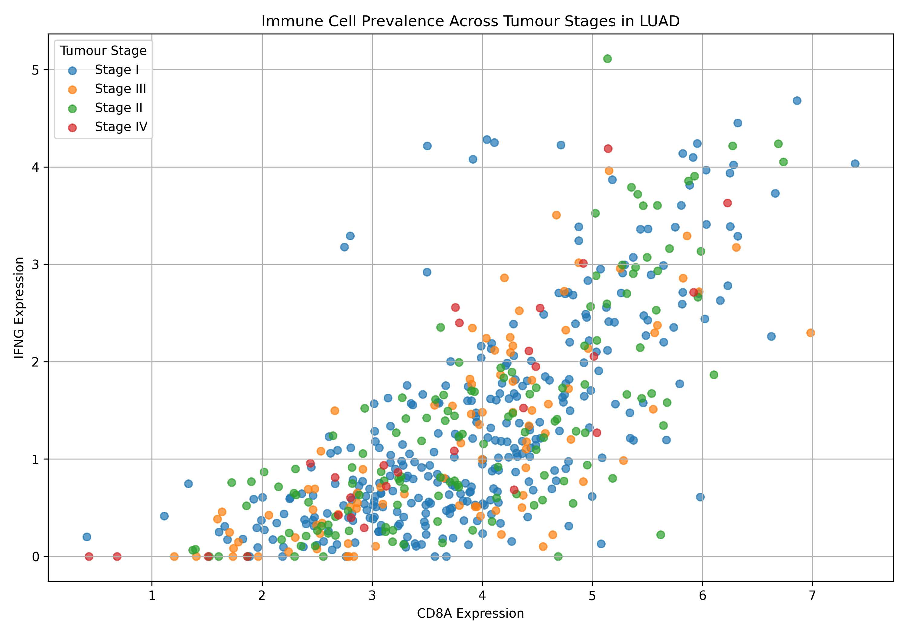
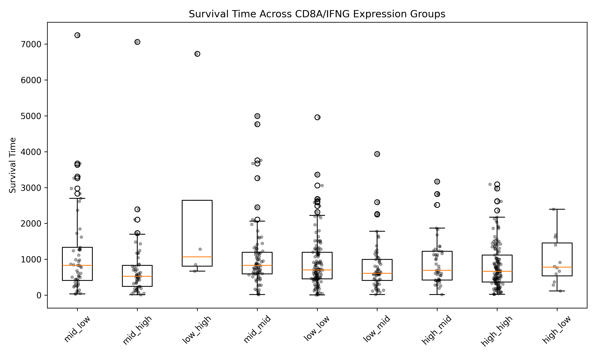
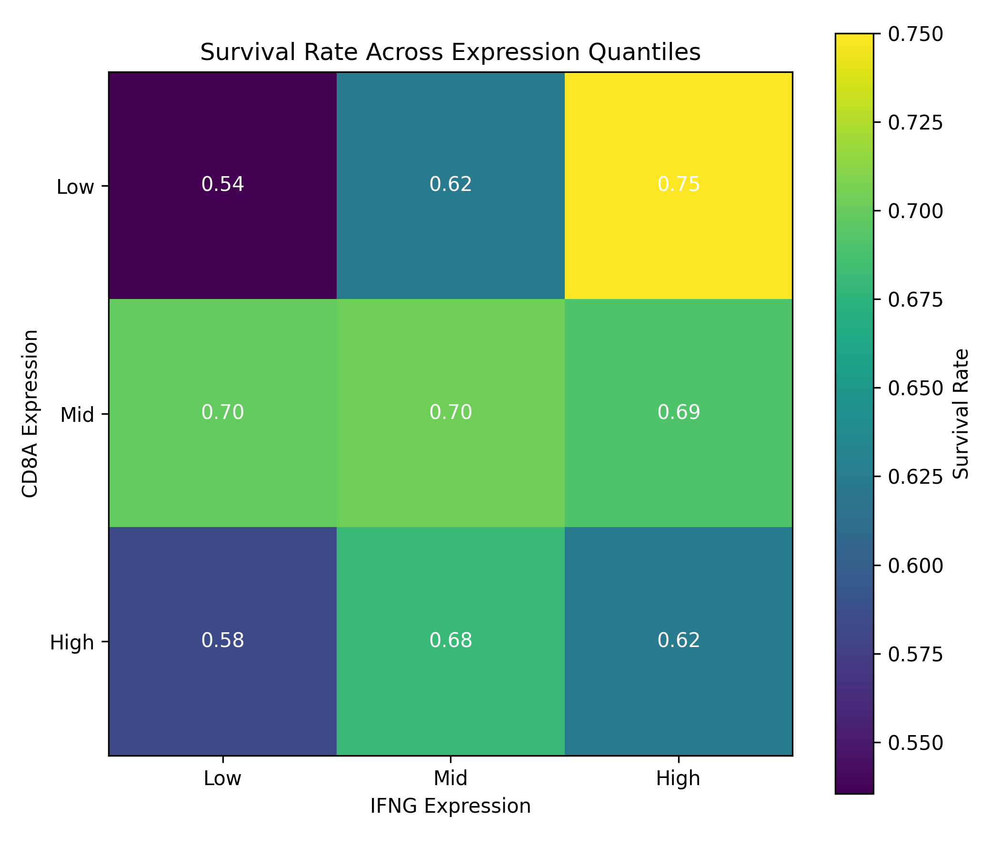
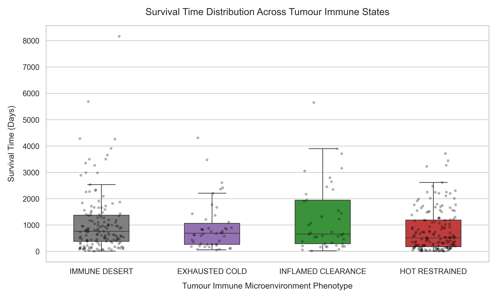
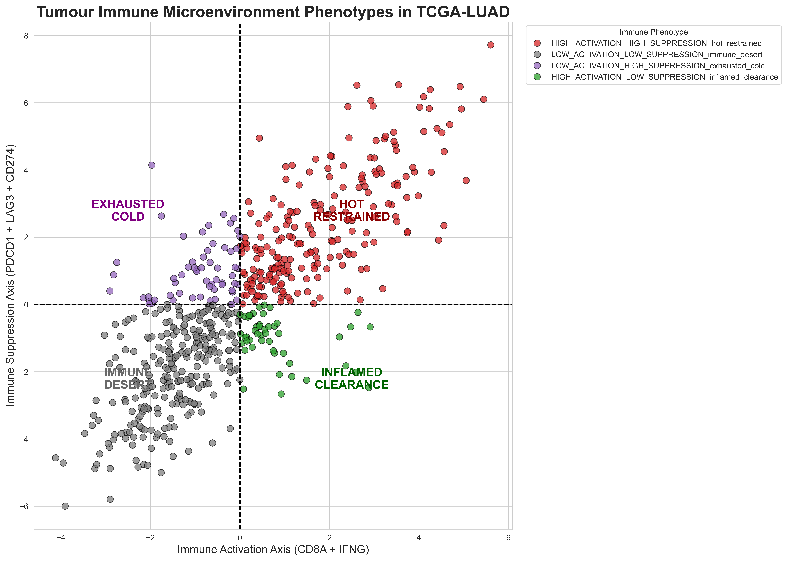
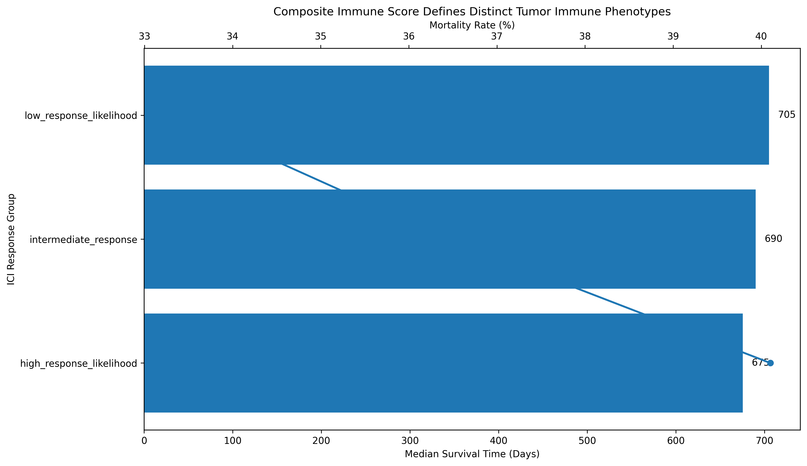

# INTRODUCTION
Immunotherapy changed the game, but the way we evaluate it is still lagging. Most current approaches reduce patient response to a binary outcome, responder vs non-responder, without fully accounting for the biological complexity driving that response. That simplification leaves a gap between what we can measure and what we actually understand.

Tumours aren’t static, and neither is the immune system interacting with them. The same therapy can produce completely different outcomes depending on whether the tumour microenvironment is inflamed, suppressed, or functionally exhausted. Markers like PDCD1 or CD274 on their own don’t tell the full story; their meaning shifts depending on the broader immune context they exist in.

This project explores how immune-related gene expression patterns shape clinical outcomes in lung adenocarcinoma. At its core, it focuses on a small set of high-signal markers; CD8A, IFNG, PDCD1, CD274, and LAG3, to examine how different immune states within the tumour microenvironment relate to patient survival.


This work is positioned as a foundation. Not just for understanding correlations, but for building toward something more predictive: systems that don’t just estimate whether a patient will respond to immunotherapy, but explain why. By structuring the data around immune context and biological behaviour, the project begins to map how gene expression, tumour environment, and clinical outcomes intersect, setting the stage for more advanced, model-driven approaches to treatment guidance.

# KEY FINDINGS
Early into the analysis, one thing became obvious: clinical stage explains way less than expected. Stage I tumours could still crash out early, while some later-stage tumours survived longer than the model says they should. The anatomy was telling part of the story, but definitely not the whole thing.

Once immune signals got layered in, the tumour microenvironment started looking less like a simple “hot vs cold” system and more like a spectrum of competing immune states. Some tumours showed strong immune activation alongside equally strong exhaustion and checkpoint suppression signals, meaning the immune system was present, but lowkey getting cooked in real time.

The most interesting part? Some of the worst baseline survival groups still carried highly inflamed, checkpoint-rich immune profiles. Meaning biologically, they may not be immune-dead at all, just immune-restrained. That distinction matters a lot for immunotherapy.

By combining activation, suppression, and exhaustion markers into composite immune balance states, the project started separating tumours into actual functional immune ecosystems instead of broad survival categories. And honestly, that’s probably where the future of AI-guided immunotherapy starts getting interesting.

# THE ANALYSIS
## BLOCK 1: CLINICAL BASELINE
### DOES STAGE STRATIFY SURVIVAL?
Before getting into immune signals, I needed to check something basic but critical,
is clinical stage alone already explaining survival?
Because if it is, everything else risks being noise. 

I validated this question by analyzing it from different perspectives, both of which yielded similar conclusions.

### PART 1: DISTRIBUTION
From this angle, I looked at stratified survival outcomes against stage distribution.

SQL QUERY
``` sql
 SELECT 
    CASE
        WHEN survival_time < 1825 THEN 'low_survival'
        WHEN survival_time  BETWEEN 1825 AND 3650 THEN 'mid_survival'
        ELSE 'great_survival'
        END AS stratified_survival,
    CASE 
        WHEN cancer_stage IN ('Stage IA', 'Stage IB', 'Stage I') THEN 'Stage I'
        WHEN cancer_stage IN ('Stage IIA', 'Stage IIB', 'Stage II') THEN 'Stage II'
        WHEN cancer_stage IN ('Stage IIIA', 'Stage IIIB') THEN 'Stage III'
        ELSE cancer_stage 
    END AS simplified_stage,
    COUNT(phenotype.patient_id) AS patient_count
FROM
    phenotype
JOIN
    survival ON survival.patient_id = phenotype.patient_id
WHERE
    cancer_stage IS NOT NULL AND cancer_stage <>''
GROUP BY
    simplified_stage,
    stratified_survival
ORDER BY
    stratified_survival ASC;  
  ```
  ### INSIGHTS

  While clinical staging traditionally stratifies survival, the data reveals it lacks the biological resolution to predict individual outcomes accurately. A clear gradient exists, where Stage IV aligns with poor prognosis and Stage I dominates the cohort, yet the anatomical spread fails to account for significant survival variability. The high volume of Stage I patients experiencing low survival suggests that early-stage labels often mask aggressive underlying pathologies. Because staging captures where a tumor is, rather than how it behaves. It effectively compresses heterogeneous biology into broad, noisy categories. This predictive plateau confirms that stage alone cannot distinguish between hidden subgroups, directly justifying the need for immune and molecular analysis to fill the gap where clinical observation ends.

  
  Fig 1. Survival Distribution by Clinical Stage.The heavy concentration of 'Low Survival' outcomes within Stage I exposes a significant disconnect between anatomical staging and actual prognosis.

  ### PART 2: MEDIAN SURVIVAL
  This POV takes in median survival and checks its distribution against stage to basically answer the same question. 

  SQL QUERY
  ``` sql
  SELECT
    CASE 
        WHEN cancer_stage IN ('Stage IA', 'Stage IB', 'Stage I') THEN 'Stage I'
        WHEN cancer_stage IN ('Stage IIA', 'Stage IIB', 'Stage II') THEN 'Stage II'
        WHEN cancer_stage IN ('Stage IIIA', 'Stage IIIB') THEN 'Stage III'
        ELSE cancer_stage 
    END AS simplified_stage,
   PERCENTILE_CONT(0.5) WITHIN GROUP (ORDER BY survival_time) AS avg_survival_days, 
    COUNT(*) AS patient_count
FROM phenotype
JOIN survival ON phenotype.patient_id = survival.patient_id
WHERE cancer_stage IS NOT NULL 
  AND cancer_stage <> '' 
GROUP BY simplified_stage
ORDER BY avg_survival_days DESC;
```
### INSIGHTS
The median survival data reveals that clinical staging offers direction without precision, as traditional stage labels fail to provide clear separation between outcomes. Stage I and II display nearly identical survival timelines (741 vs. 728 days), suggesting that an "early-stage" designation does not inherently guarantee a better prognosis. A meaningful shift only emerges at the Stage III breakpoint, where survival drops sharply to 478 days; yet, Stage IV remains an outlier, showing better median survival than Stage III. This non-linear progression exposes how a few long-term survivors have historically masked a more compressed, less optimistic reality for the typical patient. The data confirms that while staging serves as a baseline, it lacks the resolution to explain individual variability, pointing to underlying biological and immune drivers that exist independently of anatomical progression.


Figure 2: The Clinical Plateau. Median survival remains nearly identical across Stage I and II, while Stage IV outlives Stage III. This non-linear trend proves that anatomical staging fails to capture the aggressive biological drivers that actually dictate a patient's timeline.

### BLOCK INSIGHTS

Taken together, both the distribution-based and median survival analyses point to the same underlying reality: clinical stage does stratify survival, but only at a surface level. While there is a general downward trend from early to late stages, the separation is shallow and inconsistent, particularly between Stage I and II, and even extending into Stage IV. More importantly, the variability within each stage is too large to ignore, with patients under the same clinical label experiencing vastly different outcomes. This exposes a core limitation of staging. It captures where the tumour is, but not how it behaves. In practice, it functions as a broad sorting tool rather than a precise predictor, leaving a significant portion of survival variability unexplained. And that gap? That’s where the biology, and this project, starts to matter.

## BLOCK 2: IMMUNE PREVALENCE
### QUESTION 1: IS IMMUNE CELL PRESCENCE WITHIN THE TUMOUR STAGE DEPENDENT? 
 What I was really looking at here is whether the immune system recognizes and infiltrates tumours in early stages or later as the disease progresses. I used immune-gene marker  expression (CD8A & IFNG) to determine immune prescence and functionality.

SQL QUERY
 ``` sql
 WITH immune_prescence AS (
SELECT
    DISTINCT survival.patient_id,
    MAX(CASE 
        WHEN gene_map.gene_name = 'CD8A' THEN gene_expression.expression 
    END) AS cd8a_expression,
    MAX(CASE 
        WHEN gene_map.gene_name = 'IFNG' THEN gene_expression.expression 
    END) AS ifng_expression,
      CASE 
        WHEN cancer_stage IN ('Stage IA', 'Stage IB', 'Stage I') THEN 'Stage I'
        WHEN cancer_stage IN ('Stage IIA', 'Stage IIB', 'Stage II') THEN 'Stage II'
        WHEN cancer_stage IN ('Stage IIIA', 'Stage IIIB') THEN 'Stage III'
        ELSE cancer_stage 
    END AS simplified_stage
FROM
    survival
JOIN 
    gene_expression ON gene_expression.patient_id = survival.patient_id
JOIN 
    gene_map ON gene_expression.gene = gene_map.gene_id
JOIN
    phenotype ON gene_expression.patient_id = phenotype.patient_id
WHERE 
    gene_map.gene_name IN ('CD8A', 'IFNG') AND cancer_stage IS NOT NULL AND cancer_stage <>''
GROUP BY 
    simplified_stage,
    survival.patient_id
)
SELECT *,
     CASE 
        WHEN NTILE(3) OVER (ORDER BY cd8a_expression) = 1 THEN 'low'
        WHEN NTILE(3) OVER (ORDER BY cd8a_expression) = 2 THEN 'mid'
        ELSE 'high'
    END AS cd8a_group,
     CASE 
        WHEN NTILE(3) OVER (ORDER BY ifng_expression) = 1 THEN 'low'
        WHEN NTILE(3) OVER (ORDER BY ifng_expression) = 2 THEN 'mid'
        ELSE 'high'
    END AS ifng_group
FROM
    immune_prescence
ORDER BY 
   cd8a_expression DESC,
   ifng_expression DESC;
   ```
### INSIGHTS
Tumour immune prevalence demonstrated partial stage dependence, though substantial immune heterogeneity persisted across all tumour stages. Early-stage tumours already displayed broad variability in immune infiltration, ranging from highly inflamed immune-hot phenotypes with elevated CD8A and IFNG expression to profoundly immune-cold tumours with minimal cytotoxic and inflammatory signaling. This suggests that immune ecosystem complexity emerges early during tumour evolution rather than developing exclusively during advanced disease progression. 

A gradual decline in average CD8A expression was observed across advancing stages, indicating potential progressive impairment of cytotoxic T-cell infiltration as tumours evolve. Stage III tumours appeared comparatively more immune-suppressed, potentially reflecting enhanced immune escape mechanisms associated with aggressive local progression and stromal remodeling. Interestingly, Stage IV tumours did not become uniformly immune-cold and instead retained multiple highly inflamed phenotypes, implying that metastatic progression may coexist with persistent immune recognition despite ineffective tumour elimination.

These findings suggest that while tumour progression influences immune prevalence, anatomical stage alone does not fully determine immune microenvironment composition. Instead, tumours exhibit persistent immunological heterogeneity across all stages, reinforcing the importance of immune profiling as an independent dimension of tumour biology beyond conventional clinical staging.



Fig 3: Scatterplot showing CD8A and IFNG expression across tumour stages. While advanced stages demonstrated a modest decline in cytotoxic immune infiltration, substantial immune heterogeneity persisted across all stages, with both immune-hot and immune-cold phenotypes observed throughout tumour progression. 

### QUESTION 2: WHAT IS THE SURVIVAL RATE BASED ON CD8A + IFNG EXPRESSION? 
So! Ideally, more immune cells and activation SHOULD equal better outcomes yeah? Well this question challenges that by using survival rate as a proxy for better outcomes.

SQL QUERY
``` SQL
WITH expression_category AS (
SELECT
    survival.patient_id,
    survival.survival_time,
    survival.survival_status,
    MAX(CASE 
        WHEN gene_map.gene_name = 'CD8A' THEN gene_expression.expression 
    END) AS cd8a_expression,
    MAX(CASE 
        WHEN gene_map.gene_name = 'IFNG' THEN gene_expression.expression 
    END) AS ifng_expression
FROM
    survival
JOIN 
    gene_expression ON gene_expression.patient_id = survival.patient_id
JOIN 
    gene_map ON gene_expression.gene = gene_map.gene_id
WHERE 
    gene_map.gene_name IN ('CD8A', 'IFNG')
GROUP BY 
    survival.survival_time,
    survival.survival_status,
    survival.patient_id
)
SELECT *,
     CASE 
        WHEN NTILE(3) OVER (ORDER BY cd8a_expression) = 1 THEN 'low'
        WHEN NTILE(3) OVER (ORDER BY cd8a_expression) = 2 THEN 'mid'
        ELSE 'high'
    END AS cd8a_group,
     CASE 
        WHEN NTILE(3) OVER (ORDER BY ifng_expression) = 1 THEN 'low'
        WHEN NTILE(3) OVER (ORDER BY ifng_expression) = 2 THEN 'mid'
        ELSE 'high'
    END AS ifng_group
FROM
    expression_category
ORDER BY 
    survival_time DESC,
    survival_status DESC;
```
### INSIGHTS
The combined CD8A and IFNG analysis showed a much more complex relationship between immune activity and survival than expected. As anticipated, patients with low expression of both markers had the worst outcomes, which makes sense as immune-cold tumors are less visible to the immune system and therefore progress more aggressively. The high-expression group however, did not show dramatically superior survival despite having strong cytotoxic and inflammatory signaling. This suggests that high immune activation alone is not necessarily protective. 

In some tumors, persistent IFNG signaling may reflect chronic immune stimulation, where T cells are present but progressively become dysfunctional or exhausted over time. At the same time, prolonged inflammatory signaling can trigger adaptive resistance pathways such as PD-L1 upregulation, allowing the tumor to survive despite heavy immune infiltration. Interestingly, the more balanced or intermediate-expression groups showed some of the most favorable survival patterns, implying that sustained and regulated immune activity is more beneficial than extreme immune activation. The findings suggest 
that the effectiveness of the tumor immune response depends not just on immune presence, but on whether those immune cells remain functional within the tumor microenvironment.



Fig 4:Comparison of patient survival times across stratified CD8A/IFNG expression cohorts.



Fig 5: Impact of CD8A and IFNG on Survival. While mid-level CD8A expression shows relatively stable survival rates, survival varies significantly at low and high CD8A expression levels depending on IFNG concentration.

### QUESTION 3: WHAT IMPACT DO CHECKPOINT INHIBITORS HAVE ON PROGNOSIS/OUTCOME?
We've been talking of how immune prescence and activation affect clinical oucome in patients from this cohort, but we have't explored how checkpoint expression markers influence the prognosis and clinical outcomes. This question looks to adress that by using immune gene checpoint markers (PDCD1, CD274 AND LAG3).

SQL QUERY
``` SQL
WITH checkpoint_inhibitors AS (
    SELECT
    survival.patient_id,
    survival_time,
    survival_status,
    MAX(CASE 
        WHEN gene_map.gene_name = 'PDCD1' THEN gene_expression.expression 
    END) AS pdcd1_expression,
    MAX(CASE 
        WHEN gene_map.gene_name = 'CD274' THEN gene_expression.expression 
    END) AS cd274_expression,
    MAX(CASE 
        WHEN gene_map.gene_name = 'LAG3' THEN gene_expression.expression 
    END) AS lag3_expression,
    MAX(CASE 
        WHEN gene_map.gene_name = 'CD8A' THEN gene_expression.expression 
    END) AS cd8a_expression,
    MAX(CASE 
        WHEN gene_map.gene_name = 'IFNG' THEN gene_expression.expression 
    END) AS ifng_expression
FROM
    survival
JOIN
    gene_expression ON gene_expression.patient_id = survival.patient_id
JOIN
    gene_map ON gene_map.gene_id = gene_expression.gene
WHERE
    gene_name IN ('PDCD1','CD274','LAG3','CD8A','IFNG') 
GROUP BY
    survival.patient_id,
    survival_status,
    survival_time
),
ranked AS (
    SELECT *,
        NTILE(3) OVER (ORDER BY pdcd1_expression) AS pdcd1_tile,
        NTILE(3) OVER (ORDER BY cd274_expression) AS cd274_tile,
        NTILE(3) OVER (ORDER BY lag3_expression) AS lag3_tile,
        NTILE(3) OVER (ORDER BY cd8a_expression) AS cd8a_tile,
        NTILE(3) OVER (ORDER BY ifng_expression) AS ifng_tile
    FROM 
        checkpoint_inhibitors
    WHERE 
        pdcd1_expression IS NOT NULL
        AND cd274_expression IS NOT NULL
        AND lag3_expression IS NOT NULL
        AND cd8a_expression IS NOT NULL
        AND ifng_expression IS NOT NULL
)
SELECT 
    patient_id,
    survival_time,
    survival_status,
    CASE pdcd1_tile 
        WHEN 1 THEN 'low'
        WHEN 2 THEN 'mid'
        ELSE 'high'
    END AS pdcd1_group,
    CASE cd274_tile 
        WHEN 1 THEN 'low'
        WHEN 2 THEN 'mid'
        ELSE 'high'
    END AS cd274_group,
    CASE lag3_tile 
        WHEN 1 THEN 'low'
        WHEN 2 THEN 'mid'
        ELSE 'high'
    END AS lag3_group,
    CASE
        WHEN cd8a_tile = 3 AND ifng_tile = 3 THEN 'functional_immunity'
        WHEN cd8a_tile = 3 AND ifng_tile = 1 THEN 'inactive_immunity'
        ELSE 'heterogeneous'
    END AS immune_prescence,
    CASE 
        WHEN pdcd1_tile = 3 AND lag3_tile = 3 THEN 'co-exhausted_high'
        WHEN pdcd1_tile = 1 AND lag3_tile = 1 THEN 'immune_cold'
        ELSE 'intermediate'
    END AS immune_phenotype
FROM 
    ranked
ORDER BY 
    survival_time DESC, 
    survival_status DESC;
```
### INSIGHTS
The prognostic impact of checkpoint inhibitor gene expression changed a lot depending on the immune phenotype. Tumors classified as co-exhausted_high, with simultaneously high PDCD1 and LAG3 expression, had the shortest median survival even though many of them showed strong immune infiltration.

Basically, the immune system was there and active, but the T-cells appeared overworked and functionally exhausted rather than effectively killing tumor cells. On the other hand, immune_cold tumors showed low checkpoint expression, likely because very little immune activity was happening in the first place, almost like the immune system never fully clocked into the fight.

Interestingly, the intermediate phenotype had the best overall survival profile, suggesting that a balanced immune response may be more beneficial than either complete immune silence or extreme immune exhaustion. Another major pattern was the overlap between functional_immunity and co-exhausted_high states, supporting the idea of adaptive immune resistance, where tumors respond to strong immune attack by ramping up inhibitory checkpoint pathways to shut that response down.
The findings suggest that PDCD1, CD274, and LAG3 only become truly meaningful prognostic markers when interpreted within the wider immune environment of the tumor.

 

Figure 6: Correlation between survival outcomes and tumor immune states. Visual representation of survival time metrics distributed across Immuno-Desert, Exhausted Cold, Inflamed Clearance, and Hot Restrained profiles.
## BLOCK 3: IMMUNOTHERAPY RESPONSE
### QUESTION 1: DOES BALANCING IMMUNE HYPE VERSUS CHILL WITH A COMPOSITE IMMUNE SCORE DECODE TUMOUR PHENOTYPES WELL ENOUGH TO SEE IF IMMUNOTHERAPY WILL ACTUALLY HIT?
With the previous bloks, I was looking at immune prescence and functionality (CD8A + IFNG expressions) and their relation with chepoint mediated inhibitors (PDCD1, CD274, LAG3) to try and determine prognosis. 

This Block gets interesting, as I build a composite score based on th expression of all immune genes discussed in this project (CD8A. IFNG, PDCD1, CD274, LAG3) to collectively determine prognosis, based on total survival time as well as outcome.

SQL QUERY
``` sql
WITH checkpoint_inhibitors AS (
    SELECT
    survival.patient_id,
    survival_time,
    survival_status,
    MAX(CASE 
        WHEN gene_map.gene_name = 'PDCD1' THEN gene_expression.expression 
    END) AS pdcd1_expression,
    MAX(CASE 
        WHEN gene_map.gene_name = 'CD274' THEN gene_expression.expression 
    END) AS cd274_expression,
    MAX(CASE 
        WHEN gene_map.gene_name = 'LAG3' THEN gene_expression.expression 
    END) AS lag3_expression,
    MAX(CASE 
        WHEN gene_map.gene_name = 'CD8A' THEN gene_expression.expression 
    END) AS cd8a_expression,
    MAX(CASE 
        WHEN gene_map.gene_name = 'IFNG' THEN gene_expression.expression 
    END) AS ifng_expression
FROM
    survival
JOIN
    gene_expression ON gene_expression.patient_id = survival.patient_id
JOIN
    gene_map ON gene_map.gene_id = gene_expression.gene
WHERE
    gene_name IN ('PDCD1','CD274','LAG3','CD8A','IFNG') 
GROUP BY
    survival.patient_id,
    survival_status,
    survival_time
),
ranked AS (
    SELECT *,
        NTILE(3) OVER (ORDER BY pdcd1_expression) AS pdcd1_tile,
        NTILE(3) OVER (ORDER BY cd274_expression) AS cd274_tile,
        NTILE(3) OVER (ORDER BY lag3_expression) AS lag3_tile,
        NTILE(3) OVER (ORDER BY cd8a_expression) AS cd8a_tile,
        NTILE(3) OVER (ORDER BY ifng_expression) AS ifng_tile
    FROM 
        checkpoint_inhibitors
    WHERE 
        pdcd1_expression IS NOT NULL
        AND cd274_expression IS NOT NULL
        AND lag3_expression IS NOT NULL
        AND cd8a_expression IS NOT NULL
        AND ifng_expression IS NOT NULL
)
SELECT 
    patient_id,
    survival_time,
    survival_status,
    CASE pdcd1_tile 
        WHEN 1 THEN 'low'
        WHEN 2 THEN 'mid'
        ELSE 'high'
    END AS pdcd1_group,
    CASE cd274_tile 
        WHEN 1 THEN 'low'
        WHEN 2 THEN 'mid'
        ELSE 'high'
    END AS cd274_group,
    CASE lag3_tile 
        WHEN 1 THEN 'low'
        WHEN 2 THEN 'mid'
        ELSE 'high'
    END AS lag3_group,
    CASE
        WHEN cd8a_tile = 3 AND ifng_tile = 3 THEN 'functional_immunity'
        WHEN cd8a_tile = 3 AND ifng_tile = 1 THEN 'inactive_immunity'
        ELSE 'heterogeneous'
    END AS immune_prescence,
    CASE 
        WHEN pdcd1_tile = 3 AND lag3_tile = 3 THEN 'co-exhausted_high'
        WHEN pdcd1_tile = 1 AND lag3_tile = 1 THEN 'immune_cold'
        ELSE 'intermediate'
    END AS immune_phenotype
FROM 
    ranked
ORDER BY 
    survival_time DESC, 
    survival_status DESC;
```
### INSIGHTS
The composite immune score integrating immune activation markers (CD8A and IFNG) with checkpoint-associated suppressive markers (PDCD1, LAG3, and CD274) successfully stratified LUAD tumours into biologically distinct tumour immune microenvironment phenotypes. Four major immune states emerged, including immune-desert, inflamed-clearance, exhausted-cold, and hot-restrained phenotypes, reflecting varying balances between cytotoxic immune activity and checkpoint-mediated suppression. 

The hot-restrained subgroup demonstrated simultaneously elevated activation and suppression axes alongside the highest composite ICI scores, suggesting the presence of an inflamed yet immunologically constrained microenvironment potentially relevant to immune checkpoint blockade responsiveness. In contrast, immune-desert tumours exhibited low activation and suppression signals, consistent with immunologically silent phenotypes often associated with poor immune engagement. These findings demonstrate that integrating activation and suppressive immune signals provides a more nuanced characterization of the tumour immune microenvironment than isolated biomarker analysis alone.



Fig:7 Stratification of Tumors Based on Immune Microenvironment Phenotypes. Scatter plot mapping the balance between the Immune Activation Axis (CD8A + IFNG) and the Immune Suppression Axis (PDCD1 + LAG3 + CD274). Dotted grid lines set at zero partition patients into four distinct immunological states: Hot Restrained (red), Exhausted Cold (purple), Immune Desert (grey), and Inflamed Clearance (green).

###  QUESTION 2: CAN A SINGLE IMMUNE BALANCE SCORE SPLIT TUMOURS INTO REAL MICROENVIRONMENT STATES THAT LOOK BAD AT BASELINE SURVIVAL BUT ARE ACTUALLY PRIME CANDIDATES FOR CHECKPOINT THERAPY?
This is where the baseline foundation of a system that can be intergrated with AI to generate AI guided solutions in precision medicine come into play. You'll see why in a few...

SQL QUERY
``` sql
WITH immune_gene_matrix AS (
    SELECT
        survival.patient_id,
        survival.survival_time,
        survival.survival_status,
        AVG(CASE 
            WHEN gene_map.gene_name = 'CD8A' THEN gene_expression.expression
            WHEN gene_map.gene_name = 'GZMB' THEN gene_expression.expression
            WHEN gene_map.gene_name = 'IFNG' THEN gene_expression.expression
            WHEN gene_map.gene_name = 'PRF1' THEN gene_expression.expression
        END) AS immune_activation_strength,
        AVG(CASE 
            WHEN gene_map.gene_name = 'PDCD1' THEN gene_expression.expression
            WHEN gene_map.gene_name = 'CD274' THEN gene_expression.expression
            WHEN gene_map.gene_name = 'CTLA4' THEN gene_expression.expression
            WHEN gene_map.gene_name = 'LAG3' THEN gene_expression.expression
            WHEN gene_map.gene_name = 'TIGIT' THEN gene_expression.expression
        END) AS immune_checkpoint_suppression_strength,
        AVG(CASE 
            WHEN gene_map.gene_name = 'TOX' THEN gene_expression.expression
            WHEN gene_map.gene_name = 'EOMES' THEN gene_expression.expression
            WHEN gene_map.gene_name = 'HAVCR2' THEN gene_expression.expression
        END) AS immune_exhaustion_pressure
    FROM 
        survival
    JOIN gene_expression ON survival.patient_id = gene_expression.patient_id
    JOIN gene_map ON gene_map.gene_id = gene_expression.gene
    GROUP BY
        survival.patient_id,
        survival.survival_time,
        survival.survival_status
),
immune_geometry AS (
    SELECT
        patient_id,
        survival_time,
        survival_status,
        immune_activation_strength,
        immune_checkpoint_suppression_strength,
        immune_exhaustion_pressure,
        (immune_activation_strength - immune_checkpoint_suppression_strength) AS immune_effector_balance,
        (immune_activation_strength + immune_checkpoint_suppression_strength) AS immune_system_activity_load,
        (immune_exhaustion_pressure - immune_activation_strength) AS immune_dysfunction_gap,
        CASE
            WHEN immune_activation_strength > immune_checkpoint_suppression_strength
                 AND immune_exhaustion_pressure < immune_activation_strength
            THEN 'activation_dominant_effective_immunity'
            WHEN immune_activation_strength > immune_checkpoint_suppression_strength
                 AND immune_exhaustion_pressure >= immune_activation_strength
            THEN 'activation_dominant_exhausted_immunity'
            WHEN immune_checkpoint_suppression_strength > immune_activation_strength
            THEN 'suppression_dominant_immune_blockade'
            ELSE 'balanced_immune_state'
        END AS immune_state
    FROM 
        immune_gene_matrix
)
SELECT
    immune_state,
    COUNT(*) AS number_of_samples,
    AVG(survival_time) AS mean_survival_time,
    CAST(SUM(CASE WHEN survival_status = 1 THEN 1 ELSE 0 END) AS DOUBLE PRECISION)
    / COUNT(*) AS mortality_rate
FROM 
    immune_geometry
GROUP BY 
    immune_state
ORDER BY 
    mortality_rate DESC;
```

### INSIGHTS
The results support the core idea that a single immune balance-derived composite can stratify tumours into biologically coherent microenvironmental states, but the relationship with baseline survival is not linear in a simple “hot = good, cold = bad” way. Instead, the immune geometry separates tumours into at least three reproducible states: suppression-dominant immune blockade, activation-dominant effective immunity, and activation-dominant exhausted immunity. 

What stands out is that the suppression-dominant group carries the highest observed mortality rate (~0.387), while the activation-dominant effective immunity group shows a similar mortality burden (~0.382) despite slightly better mean survival time. The activation-dominant exhausted group, often biologically interpreted as a checkpoint-rich inflamed state, actually shows the lowest mortality (~0.330), suggesting that immune activation in the presence of exhaustion signals may not translate into immediate survival advantage but may reflect a distinct transitional biology rather than pure failure.

 The composite score is doing something more interesting than risk stratification alone: it is separating tumours into functional immune ecosystems where activation, suppression, and exhaustion coexist in different proportions, creating states that likely map onto differential responsiveness to checkpoint blockade. In practical terms, the “bad at baseline” label is not uniform; some of these tumours may represent immune-engaged but restrained systems that are mechanistically closer to being therapeutically reactivatable than truly immune-deserted disease.



Fig 8: Composite immune balance states reveal that suppression-dominant tumors carry the highest mortality burden, while activation-dominant exhausted tumors show unexpectedly lower mortality despite immune engagement, highlighting how activation–suppression geometry stratifies tumors into distinct microenvironmental states with non-linear survival behavior.

# TOOLS I USED
This project integrates bioinformatics data analysis with database management and version-controlled software development workflows.

- PostgreSQL - Used as the local relational database management system for hosting, organizing, and querying TCGA-LUAD clinical and gene expression datasets.
- Visual Studio Code - Used as the primary development environment for SQL query development, data exploration, and project implementation.
- Git and GitHub - Used for version control, repository management, collaborative development, and project deployment/documentation.
- UCSC Xena Browser - Used as the primary source for downloading TCGA Lung Adenocarcinoma (TCGA-LUAD) datasets, including transcriptomic and associated clinical metadata.

# CONCLUSION
This project showed that tumour immunity behaves less like an on/off switch and more like a constantly shifting ecosystem. Across the analysis, survival outcomes were shaped not just by immune presence, but by the balance between activation, suppression, and exhaustion happening inside the tumour microenvironment at the same time.

Clinical staging alone consistently lacked the resolution to explain why patients with seemingly similar disease progressed so differently. Once immune context was introduced, clearer biological patterns started emerging. Some tumours remained completely immune silent, while others were highly inflamed yet simultaneously restrained by checkpoint and exhaustion-associated pathways. In several cases, the most clinically aggressive tumours were not immune-empty, but immune-engaged and functionally trapped.

The composite immune balance models demonstrated that integrating activation and suppressive signaling creates a much deeper representation of tumour behaviour than isolated biomarkers alone. Rather than splitting patients into simplistic “good” or “bad” outcome groups, the system identified distinct immune microenvironment states with fundamentally different biological dynamics and potential therapeutic implications.

More importantly, this work establishes a foundation for future AI-driven precision immunotherapy systems. Not just models that predict response, but systems capable of interpreting why tumours respond differently by understanding the immune geometry driving their behaviour. Because the future of immunotherapy probably won’t depend on whether immune cells are present in the tumour, but whether those cells are still functional, suppressed, exhausted, or biologically recoverable.